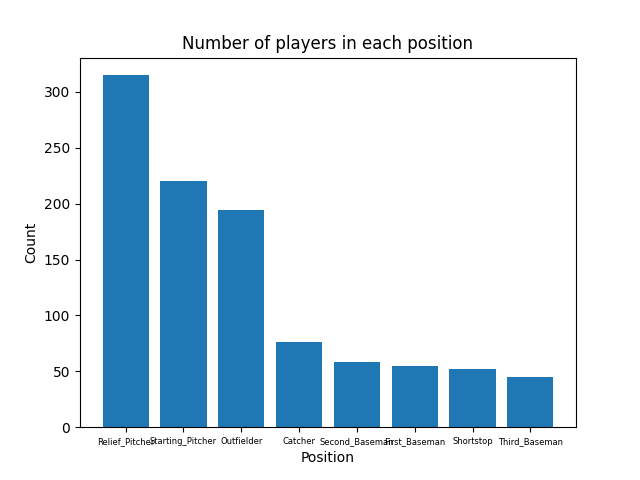
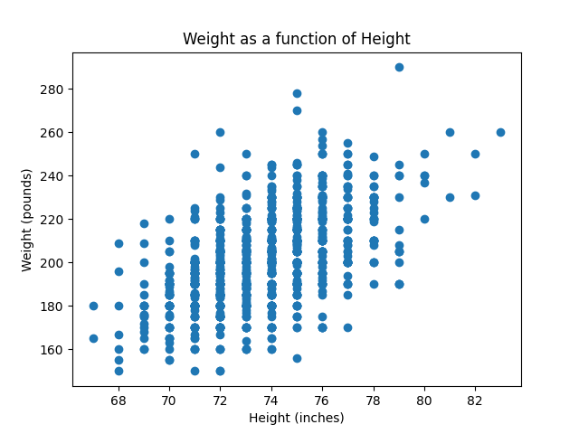

# IDS 706 Project #1 - Continous Integration on Pandas decription and visualization

Using the pandas libary was able to load, decribe, and plot various visulaztions of a baseball data set.

Performs these functions in both a Jupyter notebook and python script. Saves description statistics as descriptive_statistics.csv as well as each image.

Histogram of players in each position:

Scatter of heights vs weights of each player:

